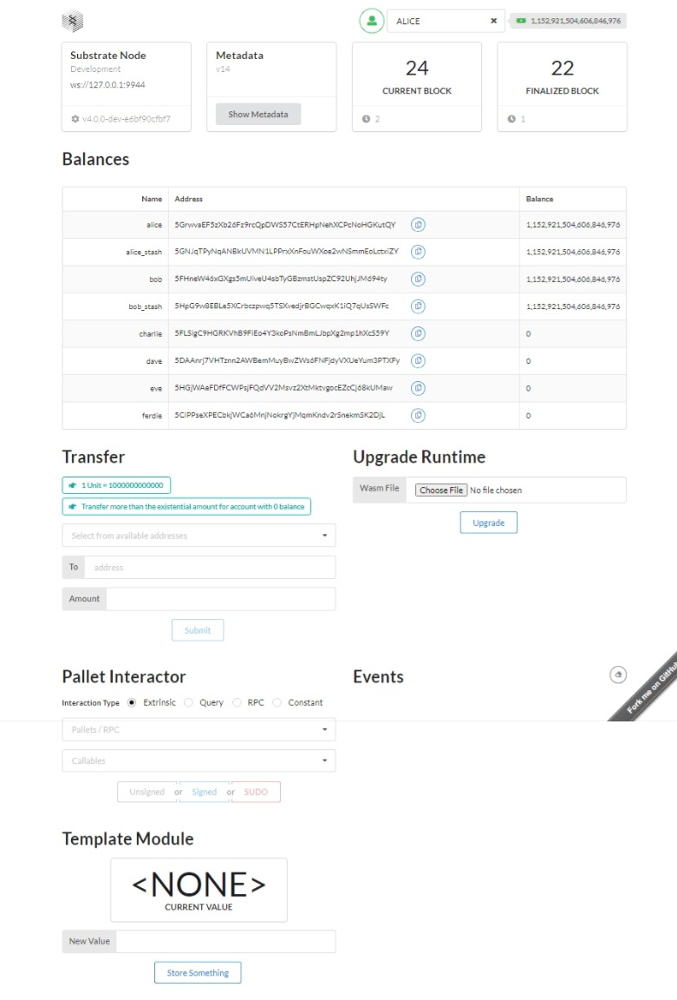

# Hands On Project - 01

Building our own blockchain using Substrate and Rust.

## Prerequisites

- [Rust](https://www.rust-lang.org/tools/install)
- [Substrate](https://substrate.dev/docs/en/knowledgebase/getting-started/#manual-installation)
- [Node.js](https://nodejs.org/en/download/)
- [Yarn](https://classic.yarnpkg.com/en/docs/install/#mac-stable)

## Setup

### Substrate Node Template

First, we need to clone the Substrate Node Template.

```bash
git clone https://github.com/substrate-developer-hub/substrate-node-template
```

After cloning the repository, we need to create a new branch to compare our project with the original template.

```bash
git switch -c $OUR_NEW_BRANCH
```

To build the project, we need to run the following command:

```bash
cd substrate-node-template
cargo build --release
```

When the build is finished, we can run the node with the following command.

The `--dev` flag is used to run the node in development mode. Which means that the node will reset its state every time it is restarted.

```bash
./target/release/node-template --dev
```

Result should look like this:

```log
2023-09-02 12:34:57 🔨 Initializing Genesis block/state (state: 0xcb7f…23a8, header-hash: 0xf856…d957)
2023-09-02 12:34:57 👴 Loading GRANDPA authority set from genesis on what appears to be first startup.
2023-09-02 12:34:57 Using default protocol ID "sup" because none is configured in the chain specs

2023-09-02 12:34:57 🏷  Local node identity is: 12D3KooWSbi12Mxi7ABz1DSWCHdPCzonMmgJYDwZCkbNefpzNjXX

2023-09-02 12:34:57 💻 Operating system: linux
2023-09-02 12:34:57 💻 CPU architecture: x86_64

2023-09-02 12:34:57 💻 Target environment: gnu
2023-09-02 12:34:57 💻 CPU: AMD Ryzen 7 5700 with Radeon Graphics
2023-09-02 12:34:57 💻 CPU cores: 8
2023-09-02 12:34:57 💻 Memory: 15.58 GiB
2023-09-02 12:34:57 💻 Kernel: 5.15.90.1
2023-09-02 12:34:57 💻 Linux distribution: Ubuntu 22.04.2 LTS
2023-09-02 12:34:57 💻 Virtual machine: yes
2023-09-02 12:34:57 📦 Highest known block at #0

2023-09-02 12:34:57 〽️ Prometheus exporter started at 127.0.0.1:9615
2023-09-02 12:34:57 Running JSON-RPC server: addr=127.0.0.1:9944, allowed origins=["*"]
```

### Substrate Frontend Template

Now, we need to clone the Substrate Frontend Template to interact with our node.

```bash
git clone https://github.com/substrate-developer-hub/substrate-front-end-template
```

After cloning the repository, we need to install the dependencies using `yarn`.

```bash
cd substrate-front-end-template
yarn install
```

To start the frontend, we need to run the following command:

```bash
yarn start
```

Result should look like this:

```log
Compiled successfully!

You can now view substrate-front-end-template in the browser.

  Local:            http://localhost:8000/substrate-front-end-template
  On Your Network:  http://127.0.0.1:8000/substrate-front-end-template

Note that the development build is not optimized.
To create a production build, use yarn build.

assets by path static/media/ 1.66 MiB
  assets by path static/media/*.svg 982 KiB 3 assets
  assets by path static/media/*.eot 230 KiB 3 assets
  assets by path static/media/*.ttf 230 KiB 3 assets
  assets by path static/media/*.woff 126 KiB 3 assets
  assets by path static/media/*.woff2 104 KiB
    asset static/media/brand-icons.278156e41e0ad908cf7f.woff2 53.2 KiB [emitted] [immutable] [from: node_modules/semantic-ui-css/themes/default/assets/fonts/brand-icons.woff2] (auxiliary name: main)
    + 2 assets
  asset static/media/flags.99f63ae7a743f21ab308.png 27.5 KiB [emitted] [immutable] [from: node_modules/semantic-ui-css/themes/default/assets/images/flags.png] (auxiliary name: main)
asset static/js/bundle.js 8 MiB [emitted] (name: main) 1 related asset
asset index.html 2.27 KiB [emitted]
asset asset-manifest.json 2.1 KiB [emitted]
cached modules 6.64 MiB (javascript) 1.66 MiB (asset) 28.7 KiB (runtime) [cached] 2341 modules
webpack 5.76.1 compiled successfully in 2600 ms
```

Frontend is now available at `http://localhost:8000/substrate-front-end-template`. When we open the URL in our browser, we should see the following page:



## Interacting with the Node

### Testing the Frontend

To test the frontend, we need to open the following URL in our browser:

```url
http://localhost:8000/substrate-front-end-template
```

In the "**Balances**" section, we can see the accounts that are available in our node and their balances.


We can also transfer funds between accounts. To do so, we need to select the account that we want to transfer funds from, and the account that we want to transfer funds to. Then, we need to enter the amount of funds that we want to transfer and click on the "**Submit**" button.


If transaction is successful, we should see the following message under the submit button:

```log
❤️️ Transaction successful! 
tx hash: 0x10c2864e22d68412cb982d87dc3405625c25e1072d9327518d9494c634c69071, 
Block hash: 0xa7bbf16f73b6936c3c8ca050b33c6089293c7268ecc02263e9045ca12116df92
```

We can also check the "**events**" section to see the details of the transaction.


After the transaction is successful, we can see that the balance of the accounts has changed.

| Name | Address | Balance |
| ---- | ------- | ------- |
| Alice | 5GrwvaEF5zXb26Fz9rcQpDWS57CtERHpNehXCPcNoHGKutQY | 1,152,886,504,297,866,829 |
| Dave | 5DAAnrj7VHTznn2AWBemMuyBwZWs6FNFjdyVXUeYum3PTXFy | 35,000,000,000,000 |
