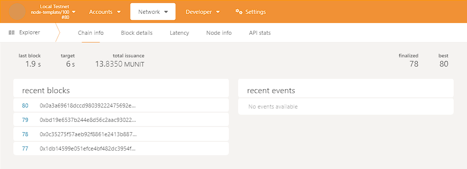

# Hands on Project - 04

## Introduction

In this chapter, we will build an  entire permissioned network of nodes. This won't be complex as real-world networks, but it will be enough to understand the basics of how a permissioned network works.

> [!NOTE]
> The changes made to the files can be found in the my fork of the `substrate-node-template` repository. You can reach the repository [here](https://github.com/jaw3l/substrate-node-template/tree/learn_substrate).

## Setup

### Node Authorization

We need to add the authorization pallet to our runtime. To do that, we need to add the following line to `dependencies` section in our `runtime/Cargo.toml` file.

```toml
[dependencies]
pallet-node-authorization = { default-features = false, version = "4.0.0-dev", git = "https://github.com/paritytech/substrate.git", branch = "polkadot-v1.0.0" }
```

We also need to add following lines to the `features` section in the same file.

```toml
[features]
std= [
    ...
    "pallet-node-authorization/std",
    ...
]
```

Now we need to add `frame_system::EnsureRoot` trait to our `runtime/src/lib.rs` file.

```rust
use frame_system::EnsureRoot;
```

### Implementing the Config Trait

We have to add the following line to the same file.

```rust
parameter_types! {
    ...
    pub const MaxWellKnownNodes:u32 = 8;
    pub const MaxPeerIdLength: u32 = 128;
    ...
}
```

Add new implementation for `pallet_node_authorization::Config` trait.

```rust
impl pallet_node_authorization::Config for Runtime {
    type RuntimeEvent = RuntimeEvent;
    type MaxWellKnownNodes = MaxWellKnownNodes;
    type MaxPeerIdLength = MaxPeerIdLength;
    type AddOrigin = EnsureRoot<AccountId>;
    type RemoveOrigin = EnsureRoot<AccountId>;
    type SwapOrigin = EnsureRoot<AccountId>;
    type ResetOrigin = EnsureRoot<AccountId>;
    type WeightInfo = ();
}
```

Add the following line to the `construct_runtime!` macro in the same file.

```rust
construct_runtime!(
    pub struct Runtime {
        ...
        NodeAuthorization: pallet_node_authorization::{Pallet, Call, Storage, Event<T>, Config<T>},
    }
);
```

To check if everything is working, we can run the following command.

```bash
cargo check -p node-template-runtime --release
```

### Base58 Codec Implementation

We need to add the following line to the `dependencies` section in our `node/Cargo.toml` file.

```toml
[dependencies]
...
bs58 = { version = "0.5.0" }
```

We need to add the following lines to the `use` section in our `node/src/lib.rs` file.

```rust
use sp_core::OpaquePeerId;
use node_template_runtime::NodeAuthorizationConfig;
```

Add the following lines to the `test_genesis` function.

We will add Alice and Bob's peer ids to the genesis config.

```rust
fn testnet_genesis(
...
) -> RuntimeGenesisConfig {
 RuntimeGenesisConfig {
  node_authorization: NodeAuthorizationConfig {
   nodes: vec![
    (
     OpaquePeerId(bs58::decode("12D3KooWBmAwcd4PJNJvfV89HwE48nwkRmAgo8Vy3uQEyNNHBox2").into_vec().unwrap()),
     endowed_accounts[0].clone(),
    ),
    (
     OpaquePeerId(bs58::decode("12D3KooWQYV9dGMFoRzNStwpXztXaBUjtPqi6aU76ZgUriHhKust").into_vec().unwrap()),
     endowed_accounts[1].clone(),
    ),
   ],
  },
...
 }
}
```

Check if everything is working by running the following command.

```bash
cargo check --release
```

### Launch Network Nodes

We will launch two nodes with the following commands.

For Alice:

```bash
./target/release/node-template \
--chain=local \
--base-path /tmp/validator1 \
--alice \
--node-key=c12b6d18942f5ee8528c8e2baf4e147b5c5c18710926ea492d09cbd9f6c9f82a \
--port 30333 \
--rpc-port 9944
```

For Bob:

```bash
./target/release/node-template \
--chain=local \
--base-path /tmp/validator2 \
--bob \
--node-key=6ce3be907dbcabf20a9a5a60a712b4256a54196000a8ed4050d352bc113f8c58 \
--bootnodes /ip4/127.0.0.1/tcp/30333/p2p/12D3KooWBmAwcd4PJNJvfV89HwE48nwkRmAgo8Vy3uQEyNNHBox2 \
--port 30334 \
--rpc-port 9945
```

To simulate node authorization, we launch another node but this time it won't be on the list of well-known nodes. We will add this node to the "well-known nodes" list using Polkadot-Substrate Portal. So, we will launch the node with the following command.

For Charlie:

```bash
./target/release/node-template \
--chain=local \
--base-path /tmp/validator3 \
--name charlie  \
--node-key=3a9d5b35b9fb4c42aafadeca046f6bf56107bd2579687f069b42646684b94d9e \
--port 30335 \
--rpc-port=9946 \
--offchain-worker always
```

### Add Charlie to the Well-Known Nodes List

First we need to open [Substrate Portal](https://cloudflare-ipfs.com/ipns/dotapps.io/?rpc=ws%3A%2F%2F127.0.0.1%3A9944#/explorer). This is a web interface for Polkadot-Substrate nodes. We will use this interface to add Charlie to the well-known nodes list.



Then we need to click the "**Developer > Sudo**" tab on the navigation bar. We can just click [this](https://cloudflare-ipfs.com/ipns/dotapps.io/?rpc=ws%3A%2F%2F127.0.0.1%3A9944#/sudo) link to go to the Sudo tab.

We will select "nodeAuthorization" from the dropdown menu and then select "addWellKnownNode(node, owner)" from the dropdown menu. We will enter Charlie's peer id and Alice's account id to the input fields. Then we will click the "**Submit Sudo**" button.